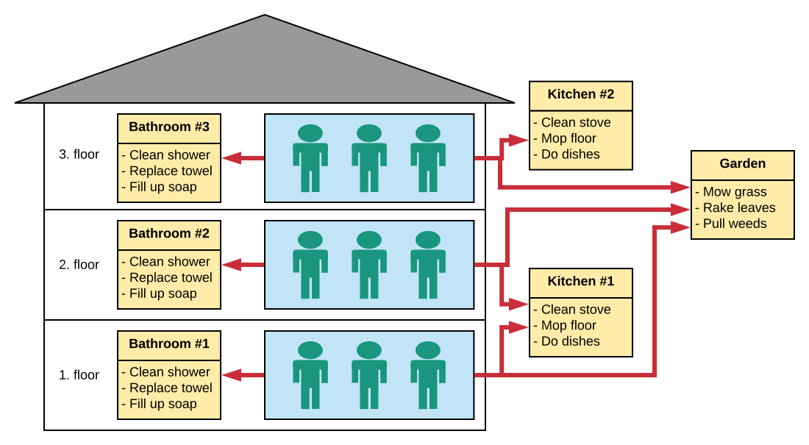

# Cleaning schedule management system (CleanSys)

CleanSys is a *cleaning schedule management system* written in Python (using the Django framework) which is built for 
medium-sized organizations with many cleaning schedules and complex relationships between Cleaners and Schedules. 

An example is its current use-case: CleanSys was built for a 15-person household with 4 floors. 
Each floor has its own weekly repeating cleaning schedules, there are two kitchens which some floors share and  
the house itself has several biweekly-repeating schedules. 
While the cleaning schedules on each floor must only be cleaned by those living on that floor, the household-wide 
cleaning schedules must be cleaned by all inhabitants. 

Another example is this visualisation of a simplified household:

When assigning cleaning duties you might want to follow these guidelines to keep the peace in your household:
- (a) Make sure every Cleaner cleans his/her fair share in each cleaning schedule he is assigned
 to *(not cleaning too much or too little)*.
- (b) Make sure a Cleaner isn't assigned too many duties at once, which is sure to kill his/her free 
time and frustrate the Cleaner. 

Assigning cleaning duties can be done on paper, as a large Excel sheet for each schedule, with Tasks on the x-axis 
and dates & assignees on the y-axis, which is how it was done in the 15-person household prior to CleanSys
_(making all the paper schedules and filling in the names took up to 2 hours every 3 months)_. 

An electronic solution, which CleanSys provides, takes over this tedious task and provides additional features.  
One of them: CleanSys offers a quick and easy way for Cleaners to switch duties with each other, in case someone's 
vacation is getting in the way of their cleaning duties 
_(the analogue version of this is to ask the group chat and hope for a response)_.

CleanSys comes with powerful editing capabilities for the administrator, a simple interface for the Cleaners, 
simple click-on-your-name login if the Cleaners trust each other, and a strong focus on transparency (everyone can 
check if a Cleaner has done his duties).  
For work-intense cleaning schedules that split their (bi)weekly work-load on many cleaners at once, CleanSys 
makes it possible to see who did which sub-task of the cleaning duty. 

CleanSys was built for german users, so the interface language is german. If you would like to have a translation 
(and are willing to put some effort into it yourself), please open an Issue for it. 

## Installation
After cloning this project onto your local system, create a virtualenv for it *([tutorial](https://docs.python-guide.org/dev/virtualenvs/))*. 

Run all shell commands in the root directory of this project with the virtual environment **activated**.

### Installing required packages
The required pip packages and their versions are listed in `requirements.txt`. 
To install them into your venv's site-packages run `pip install -r requirements.txt`. 

### Setting up the database
This Git ships without a database, so you will have to create it yourself. 
In the terminal, first call 
`python manage.py makemigrations`, then `python manage.py migrate`. 
This will set up an empty database with all the required tables and columns. 

The admin area of CleanSys uses the login of the Django superuser you create with `python manage.py createsuperuser`. 
The username and password is up to you to choose.  

## Playing around an exploring features
The best place to start is to set up the demonstration database. 
The function to create it is implemented as a Django management command and is simply called with:
`python manage.py create_demo_database`

### First steps
