# Cleaning schedule management system (CleanSys)

CleanSys is a *cleaning schedule management system* written in Python (using the Django framework) which is built for 
large households with many cleaning schedules and time-variant relationships between Cleaners and Schedules. 

It makes sure that:   
- Every Cleaner cleans his/her fair share in each cleaning schedule he/she is assigned
 to *(not cleaning too much or too little)*.
- A Cleaner's work load is spread out over time as much as possible.  

*A simplified example of a use-case:*


CleanSys was built for a 15-person household with 4 floors. 
Each floor has its own weekly repeating cleaning schedules, two kitchens which some floors share, and 
several schedules which apply to the entire household. 

This cleaning-schedule management system takes over the tedious task of creating schedules on paper 
and provides additional features, such as a quick and easy way for Cleaners to switch duties with each other.

CleanSys comes with powerful editing capabilities for the administrator, an intuitive interface for the Cleaners, 
simple click-on-your-name login, and a strong focus on transparency with a granularity down to the 
 sub-task level of each schedule.  

This project was made with german users in mind, so the interface language is german as well. 
If you would like to have a translation 
(and are willing to put some effort into it yourself), please open an Issue for it. 

## Screenshots
Here is a selection of CleanSys' pages:

#### Cleaner's pages (best on mobile clients)
Login page | Cleaner's main page | Duty tasks page | Schedule overview (current week is highlighted) 
--- | --- | --- | ---
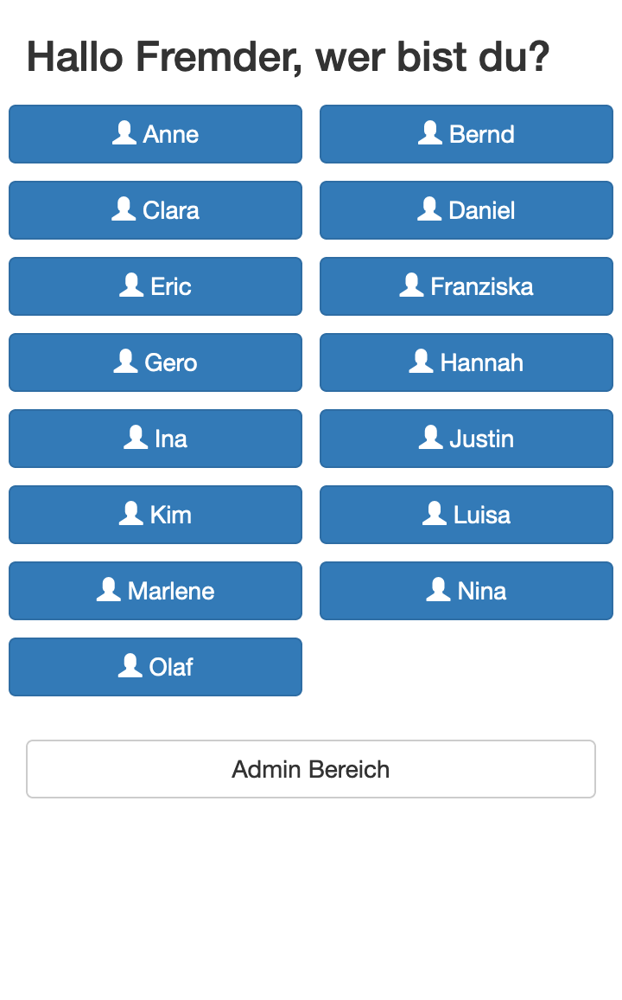 | 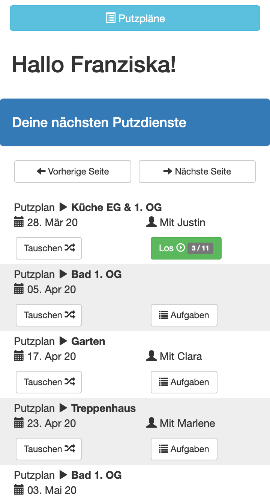 | 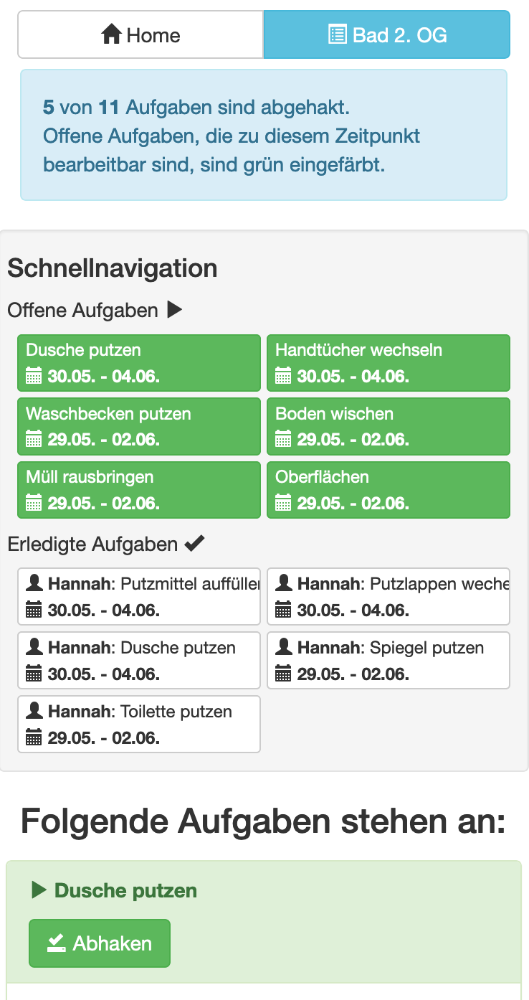 |  | 

Schedule print view | Analytics page showing assignment count of all cleaners over time 
--- | ---
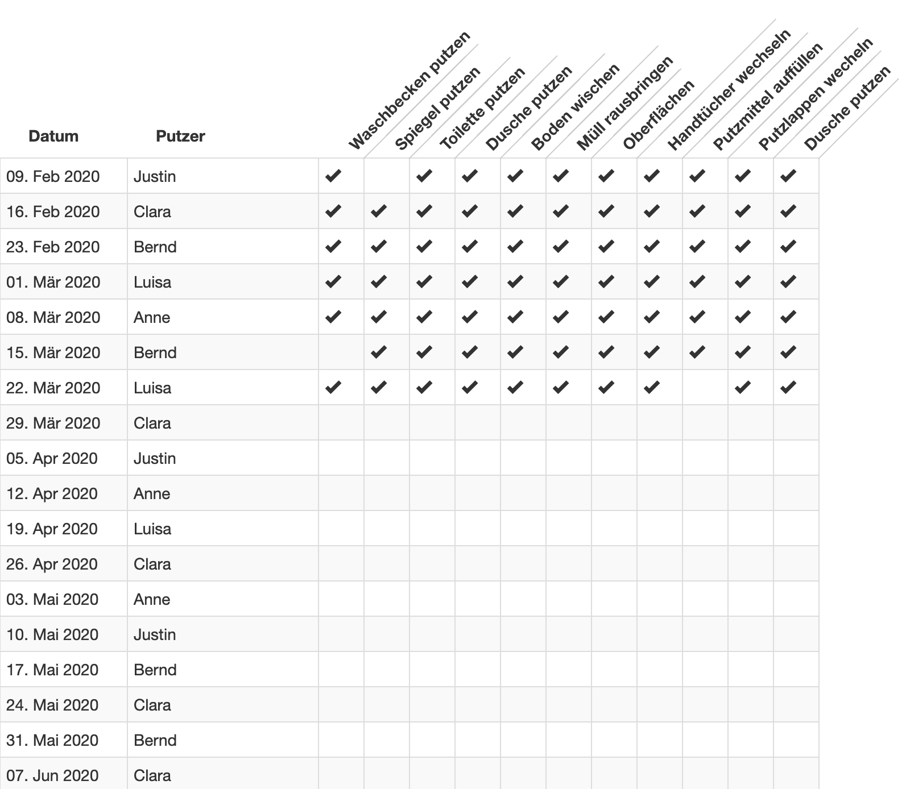 | 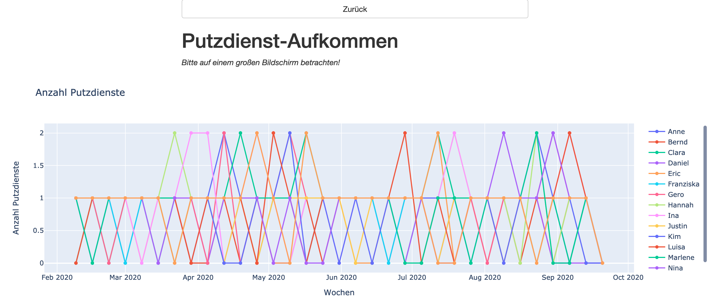

#### Admin pages
Administration main page | Cleaner creation form | Schedule creation form
--- | --- | ---
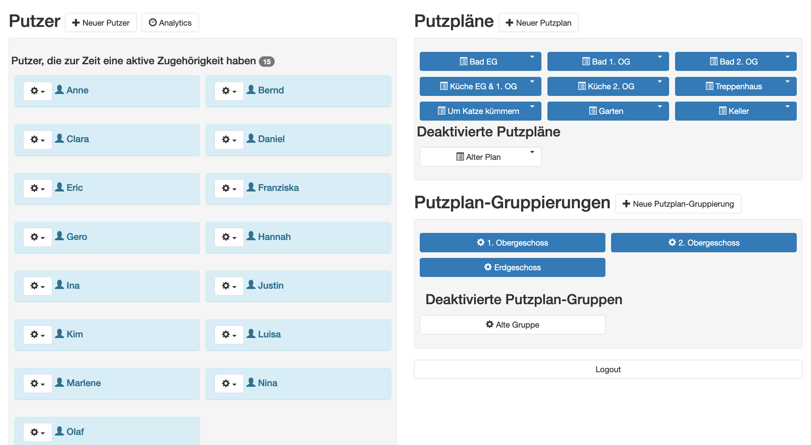 | 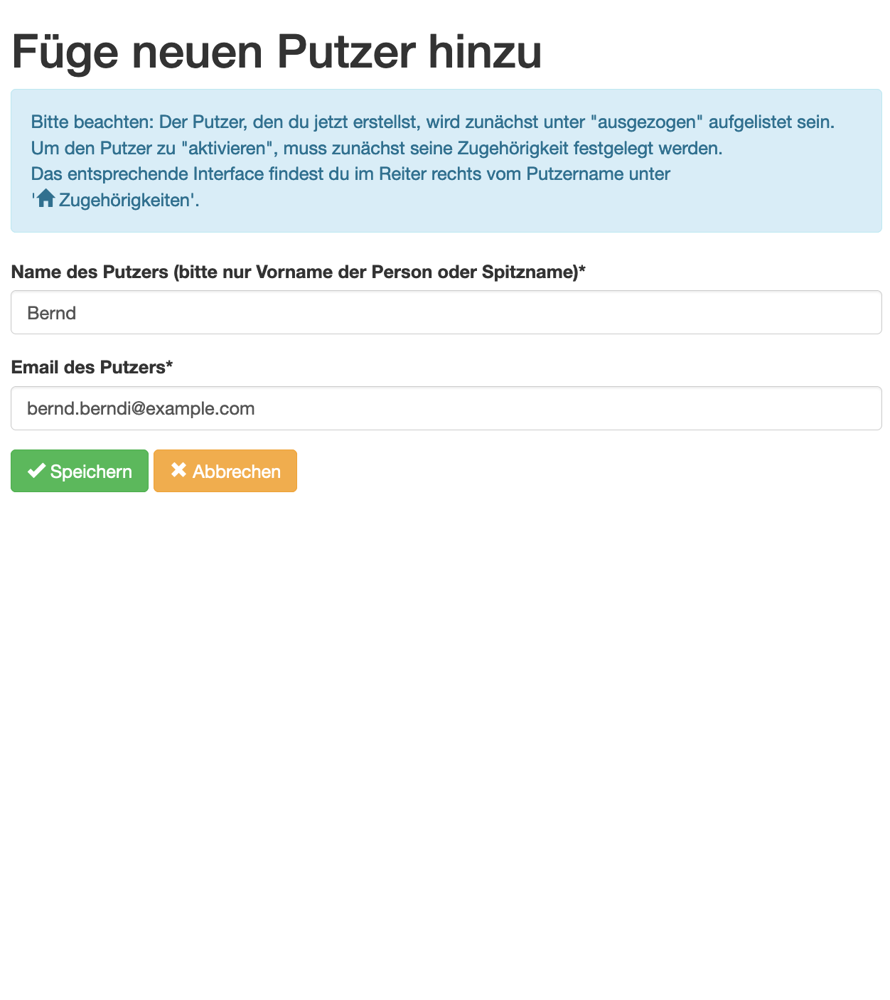 | 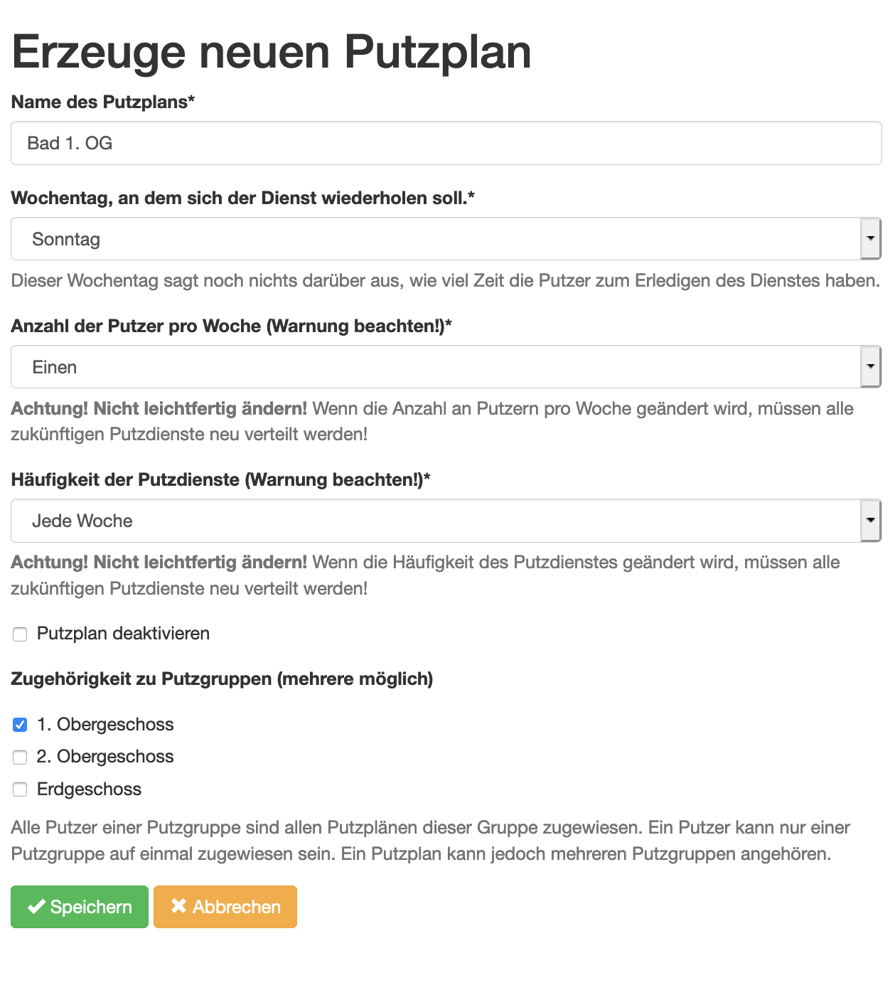

Schedule group creation form | Affiliate a Cleaner with a schedule group | Tasks for a specific schedule | Add a new task to a schedule
--- | --- | --- | ---
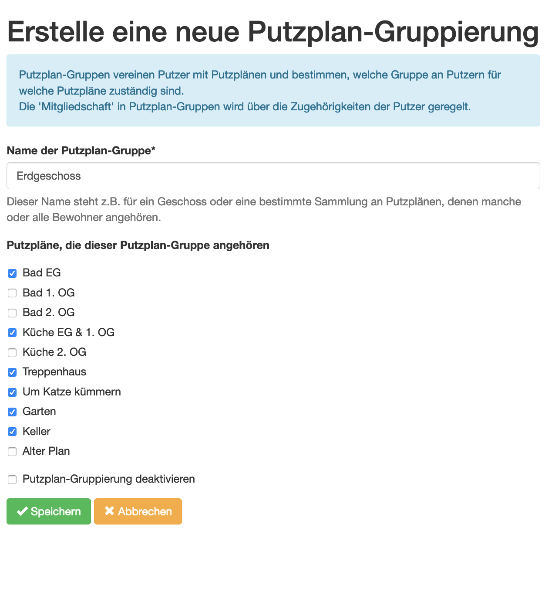 | 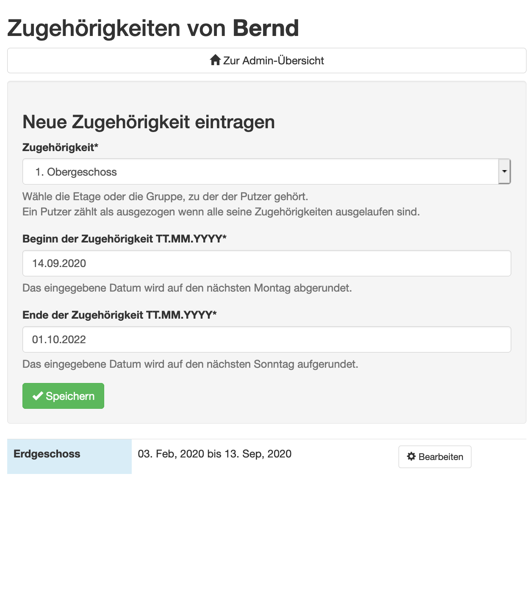 | 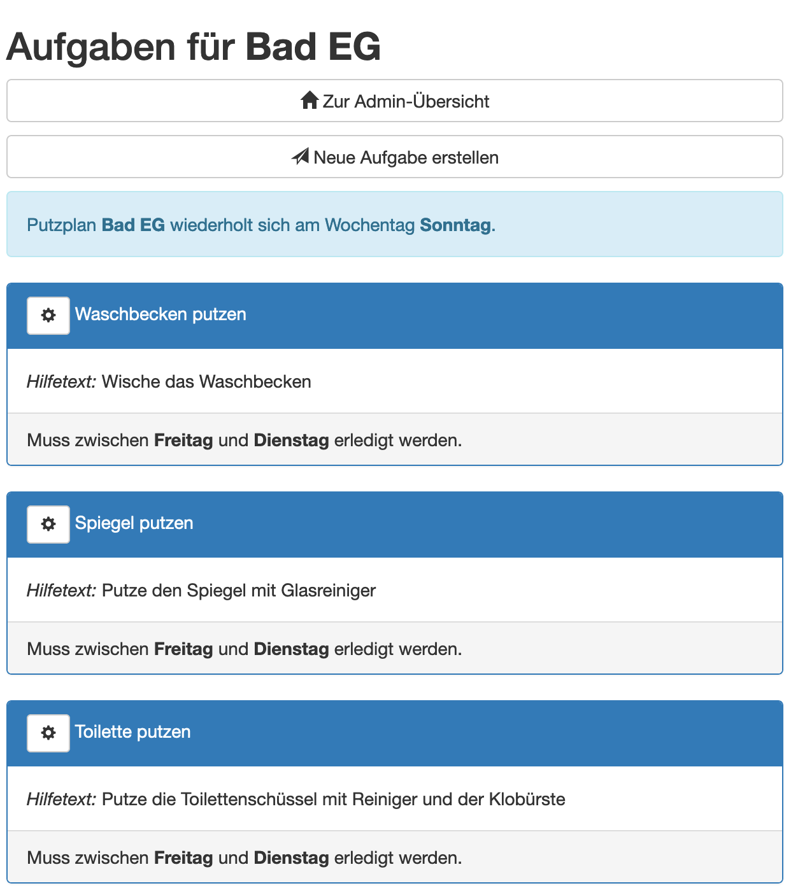 | 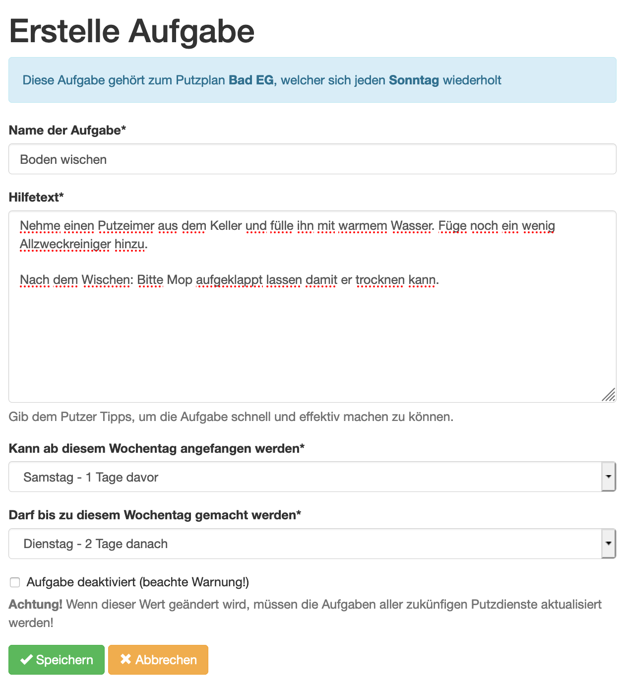

# Installation

#### 1. Clone the project
Clone the project into your workspace: 

```bash
cd /path-to-workspace/
git clone https://github.com/monoclecat/cleansys.git
cd cleansys
```

#### 2. Create a virtual environment and activate it
A virtual environment isolates Python environment of CleanSys from your system's Python environment. 

```bash
pip3 install virtualenv  # If you haven't installed the virtualenv package
virtualenv -p python3 .  # Create virtualenv inside the newly cloned repository
source bin/activate  # activate the virtualenv
```

For the next steps, all shell commands are assumed to be run in the root directory of this project 
with the virtual environment **activated**.

### Installing required packages
The required pip packages and their versions are listed in `requirements.txt`. 
To install them into your venv's site-packages run `pip3 install -r requirements.txt`. 

### Setting up the database
This Git ships without a database, so you will have to create it yourself. 
In the terminal, first call `python manage.py makemigrations`, then `python manage.py migrate`. 
This will set up an empty database with all the required tables and columns. 

The admin area of CleanSys uses the login of the Django superuser you create with `python manage.py createsuperuser`. 
The username and password is up to you to choose.  

### Playing around an exploring features
The best place to start is to set up the demonstration database. 
The function to create it is implemented as a Django management command and is simply called with:
`python manage.py create_demo_database`

To start the Django server, run `python manage.py runserver`. 

